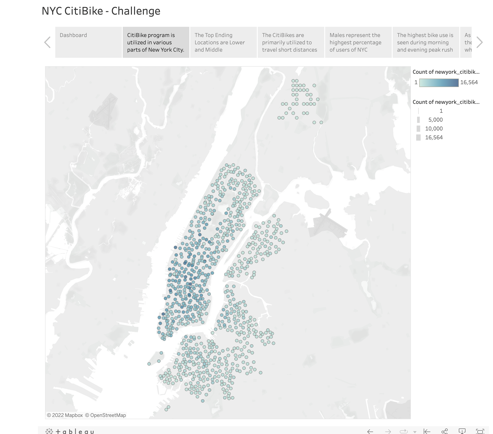
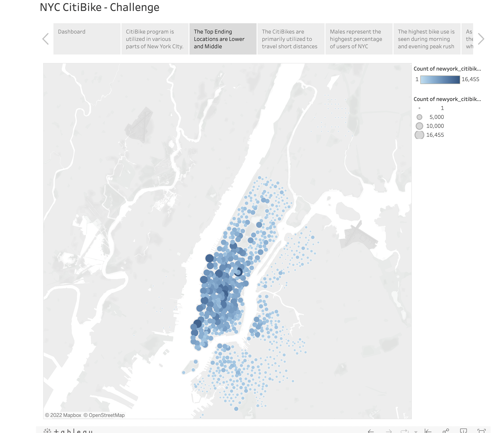
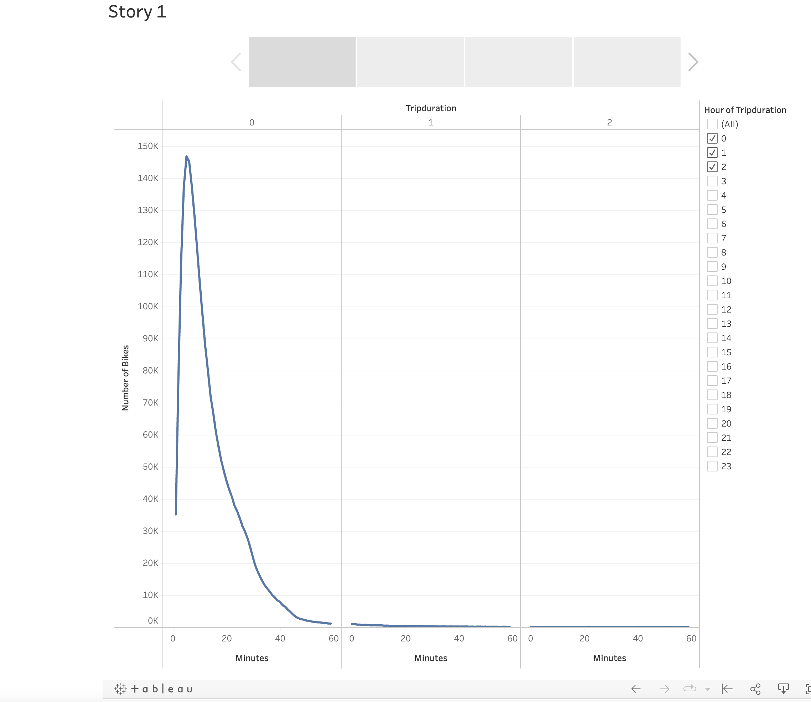
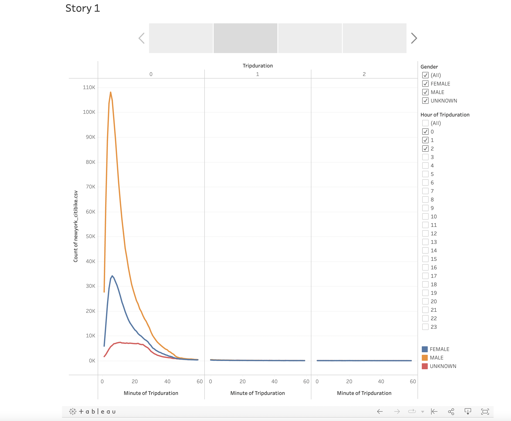
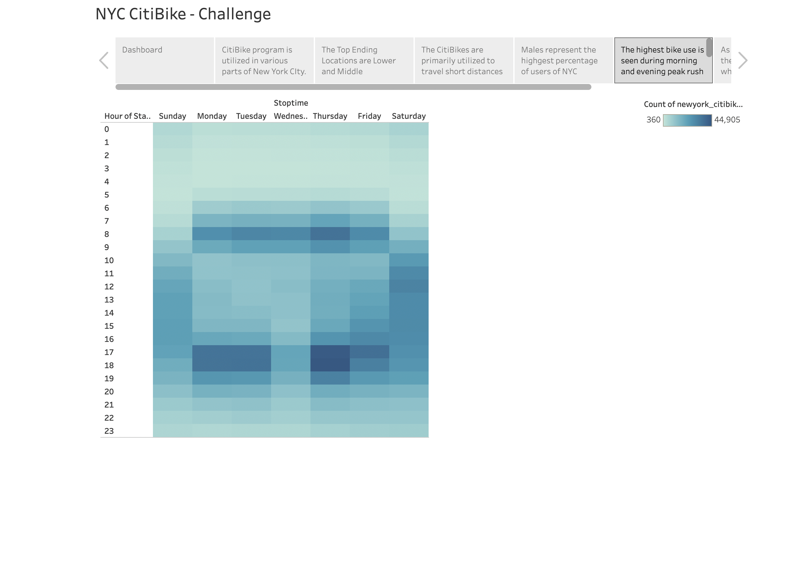
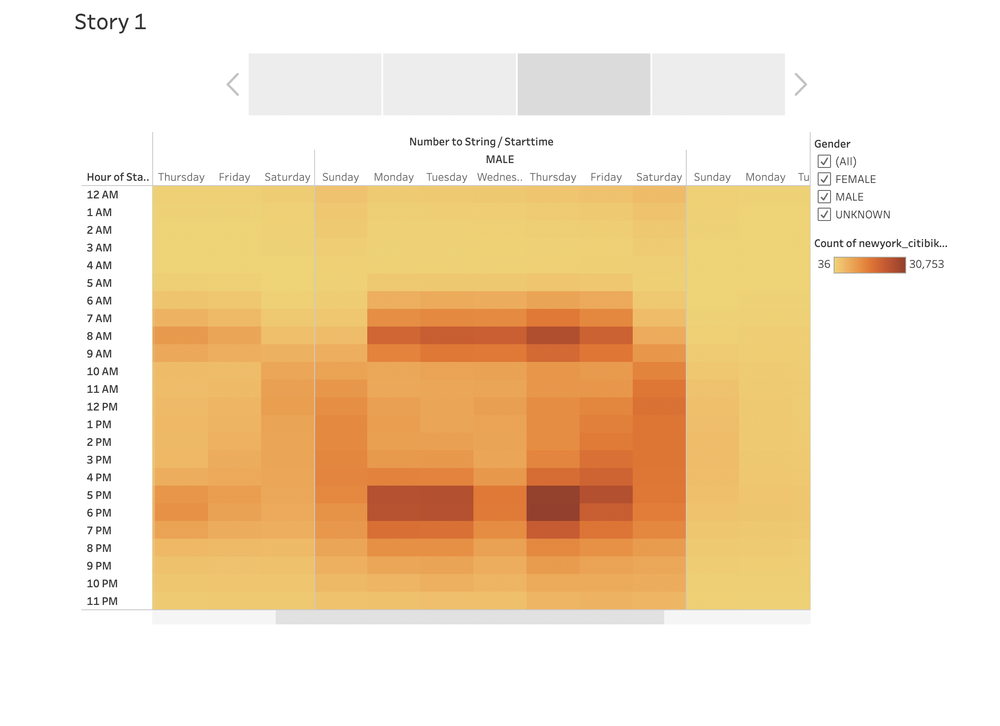
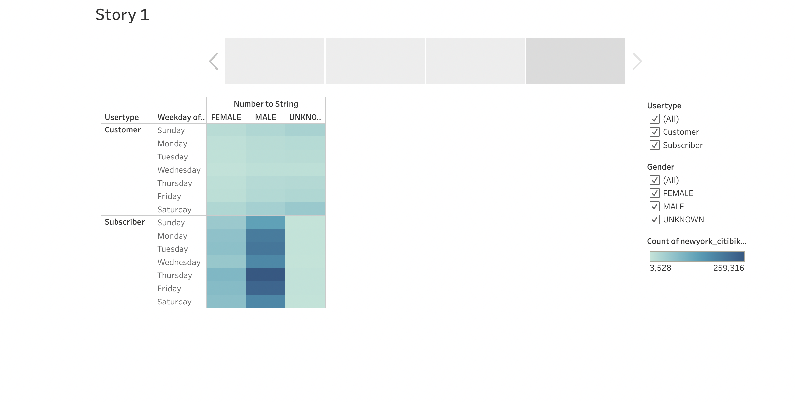

# Bikesharing

## Overview of the Analysis

The purpose of the project is to analysis NYC CitiBike program and to assess the viability of implementing this business plan in a different city.

To view the story [Click Here](https://public.tableau.com/app/profile/ruslana.nikolaev/viz/NYC_bike_16616201325850/NYCCitiBike-Challenge?publish=yes)

## Results

### Top Starting Locations:

CitiBike program is utilized in various parts of New York City. The highest ride frequency and highest total number of rides is clustered around Manhattan. The top starting locations are spread out across Manhattan and Downtown Brooklyn.   

### Top Ending Locations:

The Top ending Locations are concentrated around Lowerside and Midtown Manhattan which has the highest number of office buildings.  

### Checkout Times for Users:

The checkout times for CitiBike users is on average 20 minutes. 

### Checkout Times by Gender:

Males represent the hgihest percentage of users in NYC. 

### Trips by Weekday:

The highest bike use is seen during morning and evening peak rush hours when traffic jams are common in and around Manhattan.  

### Trips by Gender:

The number of riders who are males are far greater than for other genders with highest number of riders in the morning and early evening hours. 

### Trips by Gender by Weekday

The number of riders is highest for males and is the highest on Thursdays. 

## Summary

The data shows high activity of the bike sharing service in New York City during the month of August 2019. The highest use of Citi Bikes is by males during morning and evening peak rush hours on weekdays and afternoon hours on weekends, and clustered around Lower Manhattan and Midtown Manhattan. 
